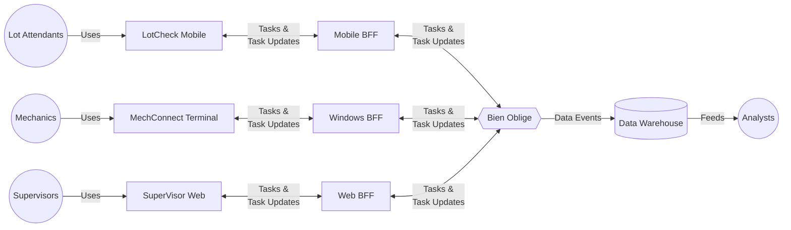
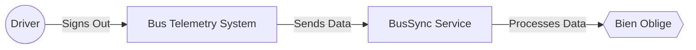
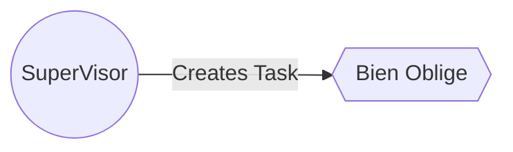

# Detailed Use Cases

## MetroTransit

MetroTransit is a fictional public transportation company that operates a large fleet of buses. To ensure the safety and reliability of its vehicles, MetroTransit has implemented a comprehensive maintenance system that leverages **Bien Oblige** for task management. This system manages the maintenance tasks for the entire bus fleet, from initial inspections to complex repairs and regulatory certifications. The system involves multiple user roles, each with specific responsibilities and interfaces tailored to their needs.

## Actors

* **Lot Attendants** - Conduct initial inspections, perform minor repairs, and update task statuses using mobile devices.
* **Mechanics** - Address complex repairs, perform testing of systems and components, certify regulatory inspections, and update the task management system with repair details and task statuses using dedicated terminals.
* **Supervisors** - Oversee the entire maintenance process, verify task completion, approve documentation, monitor progress through a web-based dashboard, and generate reports for future planning.
* **Analysts** - Utilize data flowing into their systems to monitor task completion times, identify bottlenecks and inefficiencies, and provide insights and recommendations for process optimization using customized queries, scripts, and reports.

## The Bus Maintenance Systems

### End User Applications

Each user community interacts with the system through dedicated applications tailored to their needs.

* Lot Attendants utilize the *LotCheck* Mobile app on their handheld devices to perform initial inspections and update task statuses, interfacing with the system via a Mobile Backend-for-Frontend (BFF) service.
* Mechanics access the system through the *MechConnect* Terminal application on dedicated Windows terminals througout the garage, allowing them to handle detailed repair tasks and record updates, facilitated by a Windows BFF.
* Supervisors manage and oversee the entire maintenance process using the *SuperVisor* Web application accessed via desktop browsers, which connects through a Web BFF service for comprehensive task management and reporting.

Central to the system, **Bien Oblige** operates as the core task management hub ensuring seamless data flow and coordination among the various user roles. Task updates and information flow bidirectionally between the apps and the system, while the Data Warehouse receives data events for storage and analysis. Analysts leverage this data through their analytical tools to identify process inefficiencies and recommend improvements, enhancing the overall efficiency and reliability of the maintenance operations.

### Back-end Services

#### The BusSync Integration Service

A custom service created by MetroTransit called *BusSync* automates the creation of inspection and staging tasks based on telemetry data from the bus fleet. When a driver signs out at the end of their shift, *BusSync* processes the telemetry information to determine the next steps: if the driver reported any issues, a maintenance workflow is initiated. If no issues are reported and the bus is not scheduled for maintenance, *BusSync* automatically generates tasks for nightly inspections and staging, ensuring the bus is ready for the next day. This service interfaces with the **Bien Oblige** system to manage and track these tasks, seamlessly integrating them into the existing task management framework and notifying appropriate personnel via their applications.

### Additional Integrations

On top of the automated task creation done using *BusSync*, the *SuperVisor* web app also allows maintenance and lot supervisors to manually create tasks for these user communities. This manual task creation is used for one-off tasks that are not automatically generated by the system.

## Use Case Analyses

* [Bus Nightly Procedures](./bus-nightly-procedures.md)
* [Bus Annual PM Procedure](./bus-annual-pm-procedure.md)
