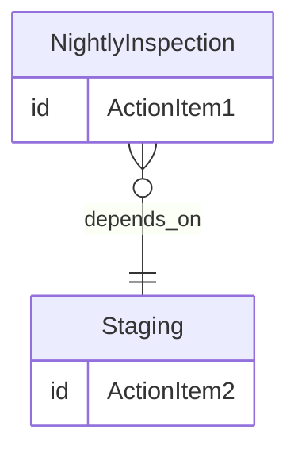

# Use Case: Bus Nightly Procedure for MetroTransit Buses

This use case demonstrates the use of Bien Oblige to create and manage tasks with prerequisites.

## MetroTransit Business Objective

To ensure that busses are inspected nightly and staged for the next day's activities.

For a description of the MetroTransit maintenance system and actors, see the [MetroTransit Use Case Overview](./README.md).

## Task Hierarchy Creation

Each night, MetroTransit buses that did not have the driver report any problems, undergo a quick inspection to be sure there are no major concerns with key safety systems such as damaged tires. The buses are then staged for the next day's activities. The tasks are broken down into phases, each with its own set of responsibilities and requirements. The completion of these tasks is critical to maintaining the safety and reliability of the bus fleet, and to the ability of the drivers to depart on-schedule.

### Nightly Tasks

* **Vehicle Nightly Inspection** - A task assigned to lot attendants to perform a quick inspection of the bus to ensure it is safe for operation the next day. This includes checking for any visible damage, lights, tires and that the bus is clean and ready for service.
  * Prerequisites: None
  * Completion method: Manual
  * EndTime: The time of the start of service for that bus the next day

* **Staging for Next Day** - Once the inspection is complete, the bus is staged in the appropriate location for the next day's activities. This task ensures that the bus is in the right place at the right time, ready for the driver to start their shift. This task specifies the location where the bus should be parked and any additional requirements for the next day.
  * Prerequisites: Vehicle Nightly Inspection
  * Completion method: Manual
  * EndTime: The time of the start of service for that bus the next day

### Implementation

The task hierarchy is structured as per the diagram below. The *Nightly Inspection* task is created without dependencies, while the *Staging for Next Day* task is created with a dependency on the *Nightly Inspection* task. This ensures that the inspection is completed before the bus is staged for the next day, and that the staging is done to the appropriate location, either the maintenance bay or the staging area.



### Task Creation Code

The following code demonstrates the creation of the nightly tasks for a MetroTransit bus. The tasks are created with the appropriate dependencies and completion times, ensuring that the bus is ready for service the next day.  Both tasks are to be done against the same bus, so the creation of the bus object is done first, and then referenced in the tasks. Since the staging task is dependent on the inspection task, the inspection task's ID is created first, and is used as a prerequisite for the staging task. The staging task does not have to have its Id specified in the code, as it it can be generated by the system.

```csharp
        const string baseUrl = "https://metrotransit.com";

        string vin = "WV3AH4709YH034586";
        string busName = "Bus X-25";
        var busId = NetworkIdentity.From(baseUrl, "bus", vin);
        var departureTime = TimeSpan.FromMinutes(375).GetTimeTomorrowMST();
        var stagingTime = departureTime.AddHours(-1); // Allow at least an hour for staging
        var inspectionTaskId = NetworkIdentity.From(baseUrl, "ActionItem", Guid.NewGuid().ToString());

        var bus = new ObjectBuilder()
            .Id(busId)
            .AddObjectType("schema:Car")
            .AddObjectType("Object")
            .Name(busName)
            .Content($"2023 MetroTransit Type X Bus with VIN *{vin}*", "text/markdown")
            .AddAdditionalProperty("schema:vehicleIdentificationNumber", vin);

        var activity = new ActivitiesCollectionBuilder()
            .CorrelationId(Guid.NewGuid())
            .ActivityType(Api.Enumerations.ActivityType.Create)
            .Actor(new ActorBuilder()
                .Id(Guid.NewGuid())
                .ActorType(Api.Enumerations.ActorType.Application)
                .Name($"{this.GetType().Name}.{nameof(NightlyTasks)}"))
            .ActionItems(new ActionItemCollectionBuilder()
                .Add(new ActionItemBuilder()
                    .Id(inspectionTaskId)
                    .Name("Nightly Inspection")
                    .Content($"Inspect bus {busName} following the Nightly Inspection procedures BKM", MimeType.From("text/plain"))
                    .EndTime(stagingTime) // 05:15 AM Tomorrow
                    .Target(bus))
                .Add(new ActionItemBuilder()
                    .Name("Stage Bus for Next Activity")
                    .Content($"If inspection passed, Stage bus *{busName}* in lane C2 for departure at 06:15 MST. If it failed, stage in the maintenance bay and create a maintenance order.", MimeType.From("text/markdown"))
                    .EndTime(departureTime) // 06:15 AM Tomorrow
                    .AddPrerequisite(inspectionTaskId)
                    .Target(bus)))
            .Build();

        var client = _services.GetRequiredService<ApiClient.Activities>();
        var response = await client.Publish(activity);
```
