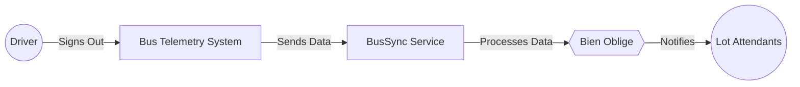

# Use Case: Bus Nightly Procedure for MetroTransit Buses

**Objective**: To ensure that busses are inspected nightly and staged for the next day's activities.

For a description of the MetroTransit system and actors, see the [MetroTransit Use Case Overview](./README.md).

## Task Hierarchy Creation

Each night, MetroTransit buses that did not have the driver report any problems, undergo a quick inspection to be sure there are no major concerns with key safety systems such as damaged tires. The buses are then staged for the next day's activities. The tasks are broken down into phases, each with its own set of responsibilities and requirements. The completion of these tasks is critical to maintaining the safety and reliability of the bus fleet.

A service called *BusSync* automates the creation of inspection and staging tasks based on telemetry data from the bus fleet. When a driver signs out at the end of their shift, *BusSync* processes the telemetry information to determine the next steps: if the driver reported any issues, a maintenance workflow is initiated. If no issues are reported and the bus is not scheduled for maintenance, *BusSync* automatically generates tasks for nightly inspections and staging, ensuring the bus is ready for the next day. This service interfaces with the **Bien Oblige** system to manage and track these tasks, seamlessly integrating them into the existing task management framework and notifying appropriate personnel via their applications.

### Nightly Tasks

* **Vehicle Nightly Inspection** - A task assigned to lot attendants to perform a quick inspection of the bus to ensure it is safe for operation the next day. This includes checking for any visible damage, lights, tires and that the bus is clean and ready for service.
  * Prerequisites: None
  * Completion method: Manual
  * EndTime: The time of the start of service for that bus the next day

* **Staging for Next Day** - Once the inspection is complete, the bus is staged in the appropriate location for the next day's activities. This task ensures that the bus is in the right place at the right time, ready for the driver to start their shift. This task specifies the location where the bus should be parked and any additional requirements for the next day.
  * Prerequisites: Vehicle Nightly Inspection
  * Completion method: Manual
  * EndTime: The time of the start of service for that bus the next day

